# Flatkey Image Prompt Library

[English](README.md) | [中文](README_zh.md) | [日本語](README_ja.md) | [Español](README_es.md) | [Português](README_pt.md) | [Tiếng Việt](README_vi.md)

Marketing-ready image generation prompt library for AI API resellers, growth pages, and user onboarding. Users can browse templates, copy prompts, replace variables, register a Flatkey API key, and generate images through an OpenAI-compatible image API.

Get API key: <https://flatkey.ai?utm_source=skill>

## Why This Exists

- **Lower activation friction**: users start from proven templates instead of a blank prompt box.
- **Increase API conversion**: every template card sends users to Flatkey API key registration.
- **Cover common commercial use cases**: product marketing, ecommerce images, social ads, infographics, avatars, app screenshots, game assets, and image edits.
- **Support batch workflows**: templates use `{{variable}}` placeholders, so apps can replace values before sending final prompts to an API.
- **Work as marketing content**: useful as a prompt gallery, tutorial page, landing page, or onboarding resource.

## Included Templates

This library currently includes 12 high-frequency image prompt templates:

- Premium product hero visual
- White-background ecommerce main image
- UGC ad cover frame
- Liquid glass Bento infographic
- Founder quote card
- Consistent avatar pack
- App Store screenshot poster
- YouTube thumbnail
- Event poster key visual
- Game prop concept sheet
- Subject-preserving background replacement
- Fashion lookbook collage

Each template includes:

- Title and use case
- Category and recommended model
- Replaceable variables
- Full prompt text
- API use-case note
- Copy prompt button
- Flatkey API key registration link

## Demo Gallery

The web gallery ships with 20 generated demo images. These are included in the npm package and shown by `image-buddy web`.

| Product | Ecommerce | Social Ad | App |
|---|---|---|---|
| 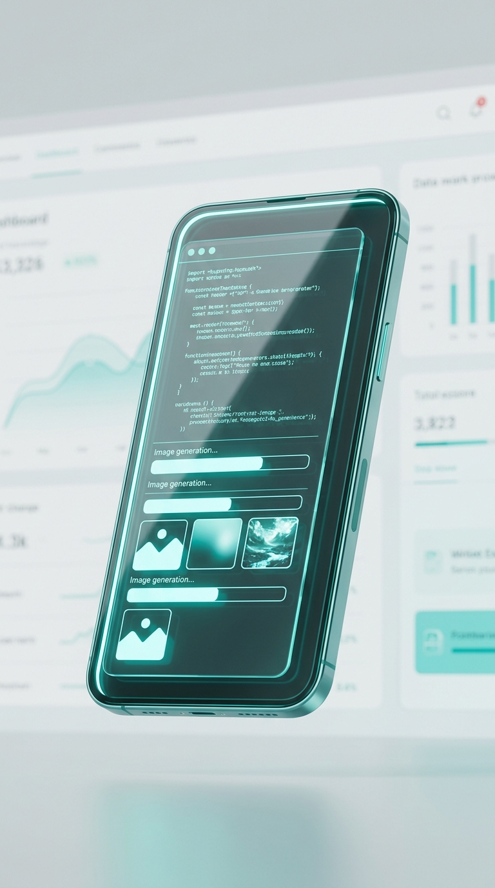<br>**SaaS Hero Phone** | 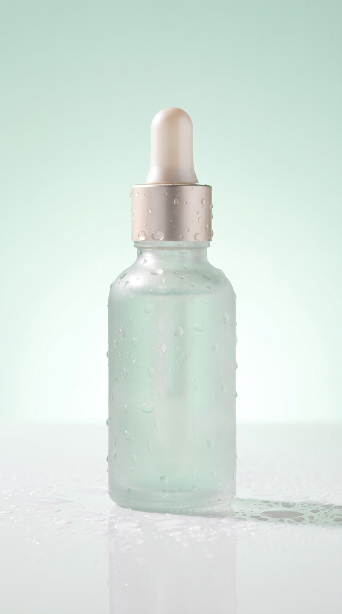<br>**Skincare Product** | 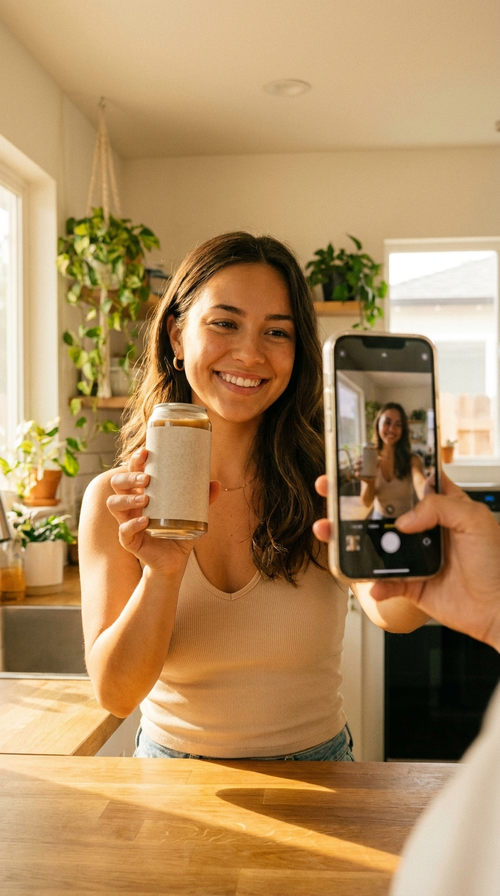<br>**UGC Coffee Ad** | 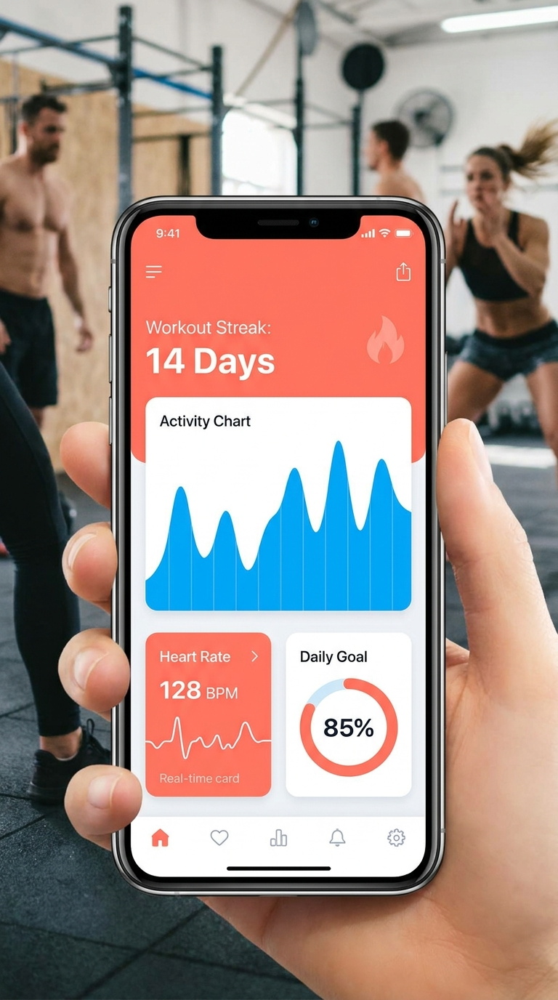<br>**Fitness App** |

| Poster | Infographic | Fashion | Game Asset |
|---|---|---|---|
| <br>**AI Agent Poster** | <br>**Liquid Bento** | 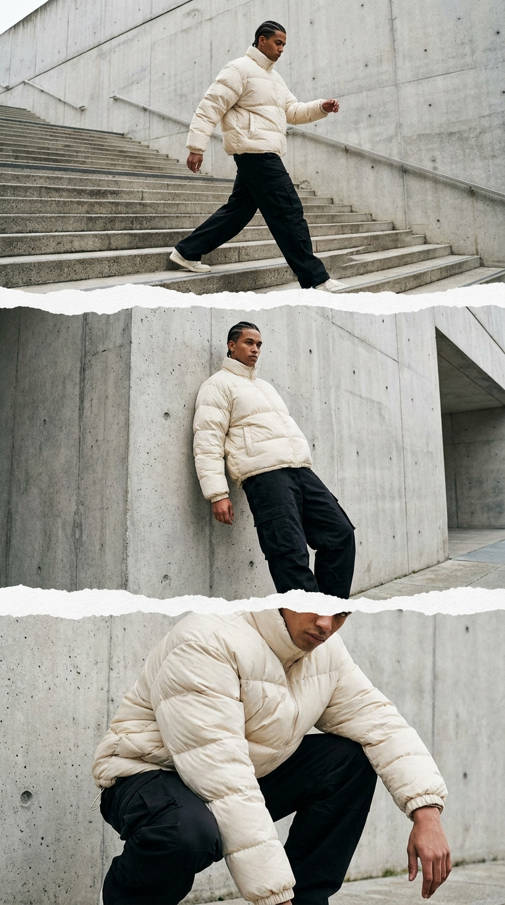<br>**Streetwear Lookbook** | 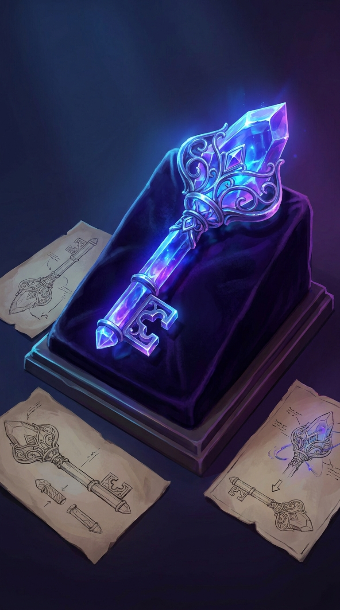<br>**Crystal Game Prop** |

| Food | Travel | Portrait | Real Estate |
|---|---|---|---|
| 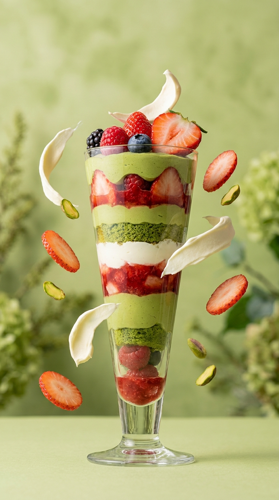<br>**Dessert Hero** | 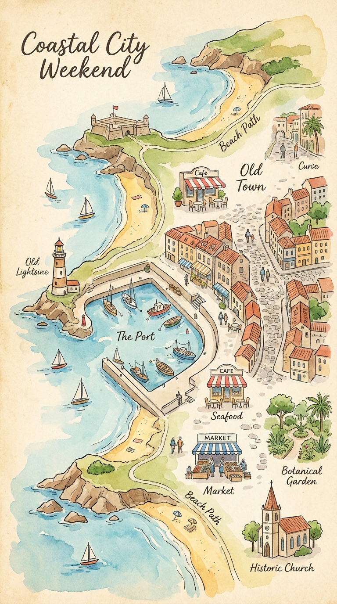<br>**Travel Map** | <br>**Cyber Portrait** | <br>**Interior Render** |

| Entertainment | Education | Finance | Beauty |
|---|---|---|---|
| 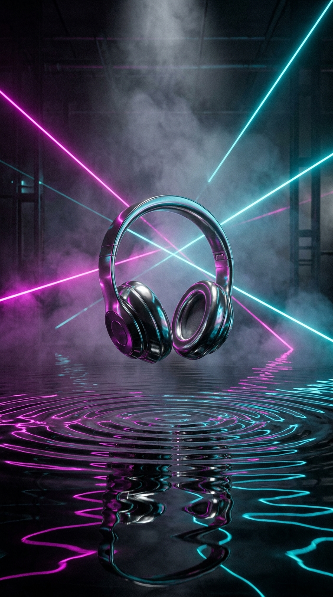<br>**Music Cover** | 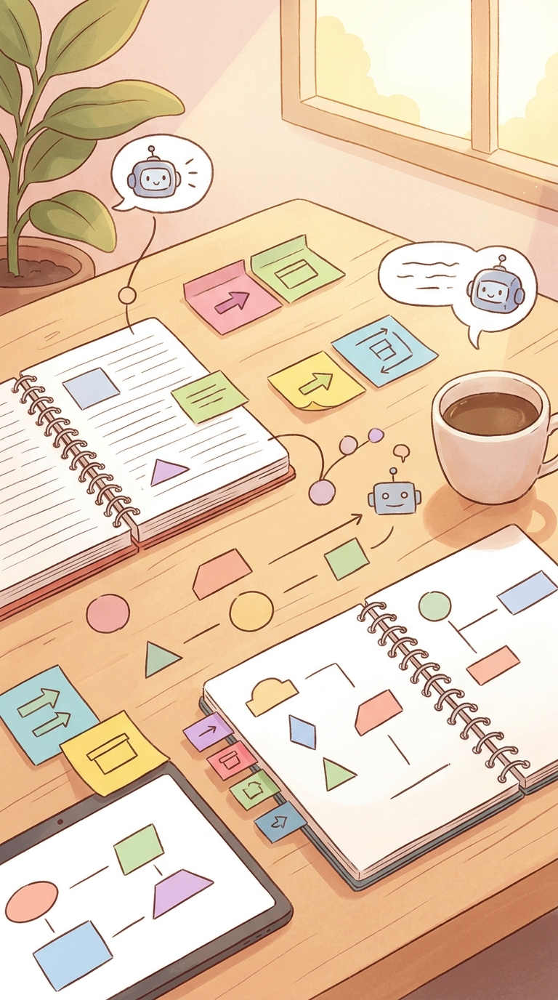<br>**Education Card** | <br>**Finance Dashboard** | <br>**Beauty Makeup** |

| Architecture | Pet | Sports | Publishing |
|---|---|---|---|
| 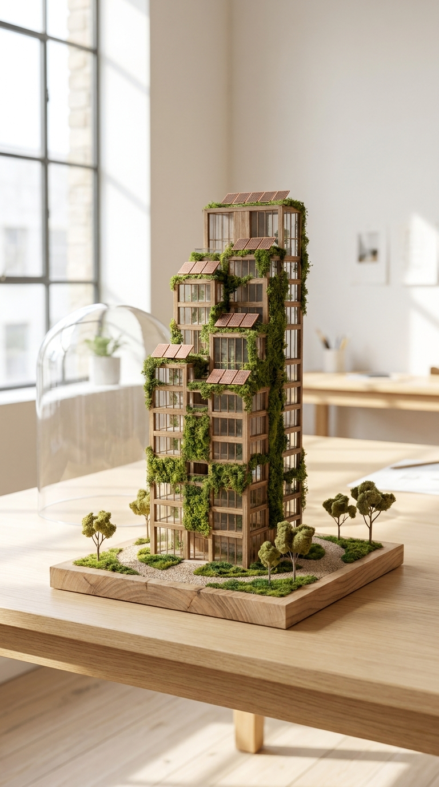<br>**Architecture Model** | 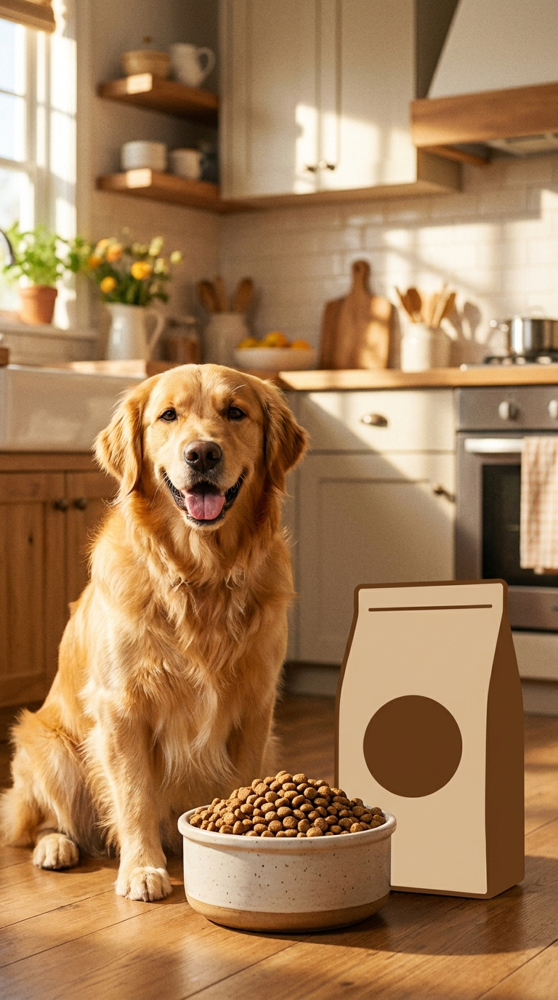<br>**Pet Brand** | 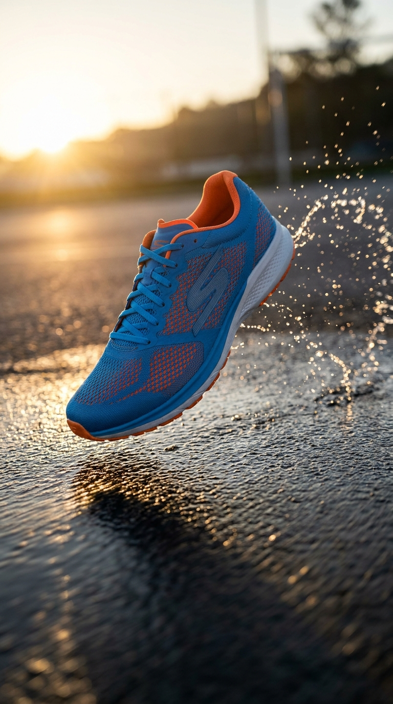<br>**Sports Shoe** | <br>**Book Cover** |

## CLI Usage

Generate from plain English:

```bash
npx @flatkey-ai/image-buddy onboard
npx @flatkey-ai/image-buddy generate --prompt "premium product hero image for an AI image API CLI, clean SaaS style, teal accents, sharp commercial lighting"
```

Generate from a template:

```bash
npx @flatkey-ai/image-buddy onboard
npx @flatkey-ai/image-buddy generate avatar-pack "地雷妹"
```

For precise template control, pass variables explicitly:

```bash
npx @flatkey-ai/image-buddy generate premium-product-hero \
  --var "产品名称=Image Buddy" \
  --var "品牌调性=clean SaaS" \
  --var "核心卖点=one-command image generation" \
  --var "主色=teal" \
  --size 1536x1024
```

Template text after the id is used as a hint. Missing variables are filled from that hint, so users do not need to learn every `--var` name before generating.

`onboard` prompts for a Flatkey API key and saves it locally. If you do not have a key, get one at <https://console.flatkey.ai/keys>. The CLI also accepts `FLATKEY_IMAGE_API_KEY` or `FLATKEY_API_KEY`, calls Flatkey image generation, and saves images locally. No web server required.

`generate` defaults to Nano Banana through `router.flatkey.ai` because it works well for direct CLI generation. Use `--model gpt` when you explicitly want the OpenAI-compatible GPT Image 2 endpoint.

Browse templates from terminal:

```bash
npx @flatkey-ai/image-buddy list
npx @flatkey-ai/image-buddy show premium-product-hero
npx @flatkey-ai/image-buddy render premium-product-hero --var "产品名称=Image Buddy"
```

Optional web gallery:

```bash
npx @flatkey-ai/image-buddy web --port 5173
```

Source install before npm release:

```bash
npx github:flatkey-ai/awesome-images
```

Useful options:

```bash
npx @flatkey-ai/image-buddy web --port 5173
npx @flatkey-ai/image-buddy web --no-open
npx @flatkey-ai/image-buddy --help
```

Developer commands:

```bash
npm install
npm test
npm run build
```

## User Flow

1. Run `npx @flatkey-ai/image-buddy generate <template-id>` or `npx @flatkey-ai/image-buddy generate --prompt "..."`.
2. Find a template by category or keyword.
3. Expand the template and copy the prompt.
4. Replace variables such as `{{product_name}}`, `{{core_benefit}}`, or `{{brand_color}}`.
5. Register a Flatkey API key at <https://flatkey.ai?utm_source=skill>.
6. Call the Flatkey OpenAI-compatible image API to generate images.

## API Example

```bash
curl https://router.flatkey.ai/v1/images/generations \
  -H "Authorization: Bearer ${FLATKEY_IMAGE_API_KEY:-$FLATKEY_API_KEY}" \
  -H "Content-Type: application/json" \
  -d '{
    "model": "gpt-image-2",
    "prompt": "final prompt after replacing template variables",
    "size": "1536x1024"
  }'
```

## Template Structure

All templates live in [src/prompts.js](src/prompts.js).

Add a new template by appending an object:

```js
{
  id: "unique-template-id",
  title: "Template title",
  category: "product",
  badge: "Hero",
  aspectRatio: "16:9",
  model: "gpt-image-2",
  apiUseCase: "Best-fit API use case.",
  description: "Template description.",
  variables: ["product_name", "core_benefit"],
  prompt: "Create a commercial hero image for {{product_name}}..."
}
```

After adding templates, run:

```bash
npm test
```

The validator checks template count, categories, variables, prompt length, and Flatkey registration links.

## Release Publishing

Publishing runs from GitHub Releases.

1. Add an npm automation token to GitHub repository secrets as `NPM_PUBLISH_TOKEN`.
2. Create a GitHub Release with tag `v1.2.3` or `1.2.3`.
3. The workflow sets `package.json` and `package-lock.json` to that release version.
4. The workflow runs validation, build, and `npm publish --access public`.

## Star History

[](https://www.star-history.com/#flatkey-ai/awesome-images&Date)
